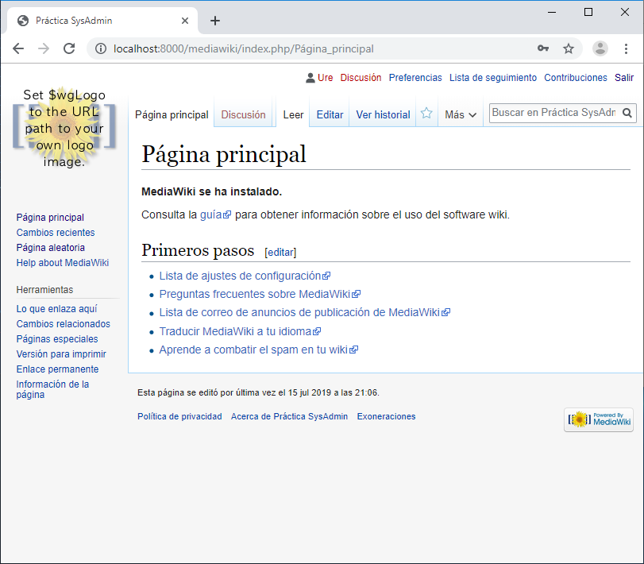
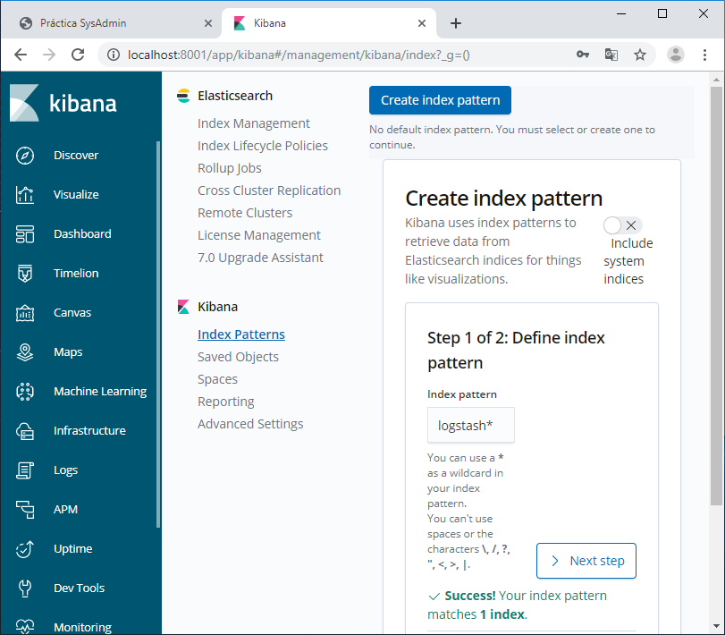
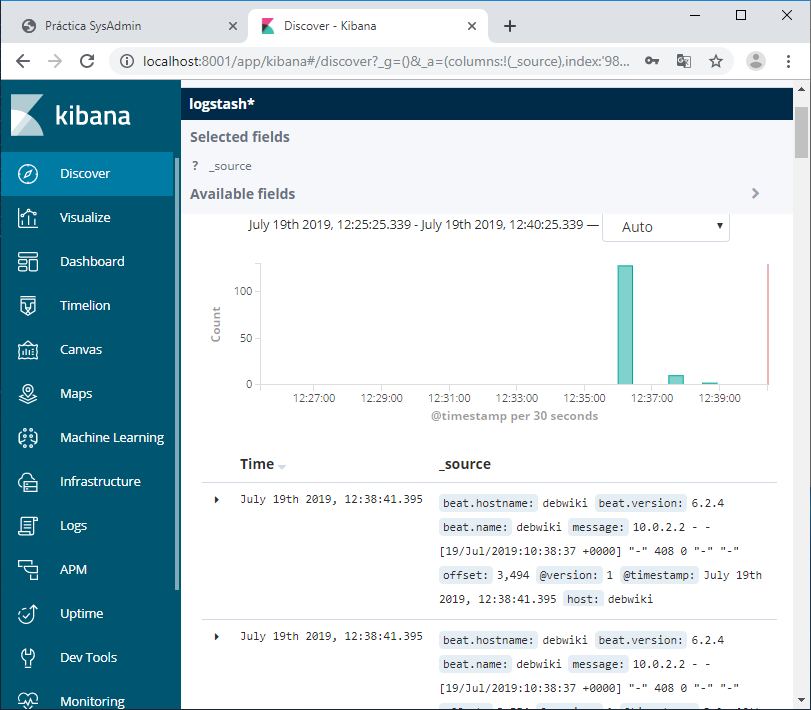
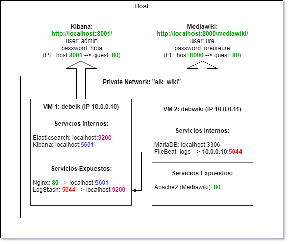
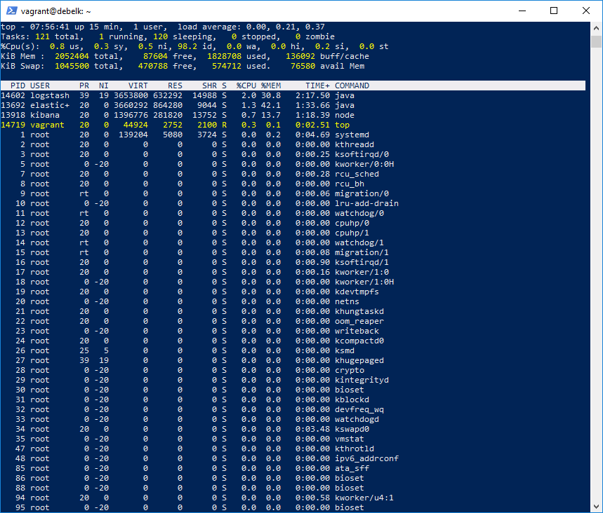
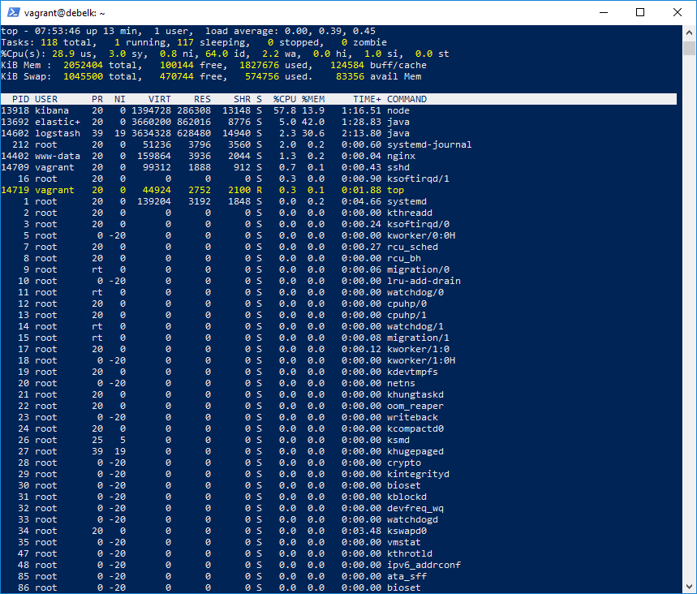
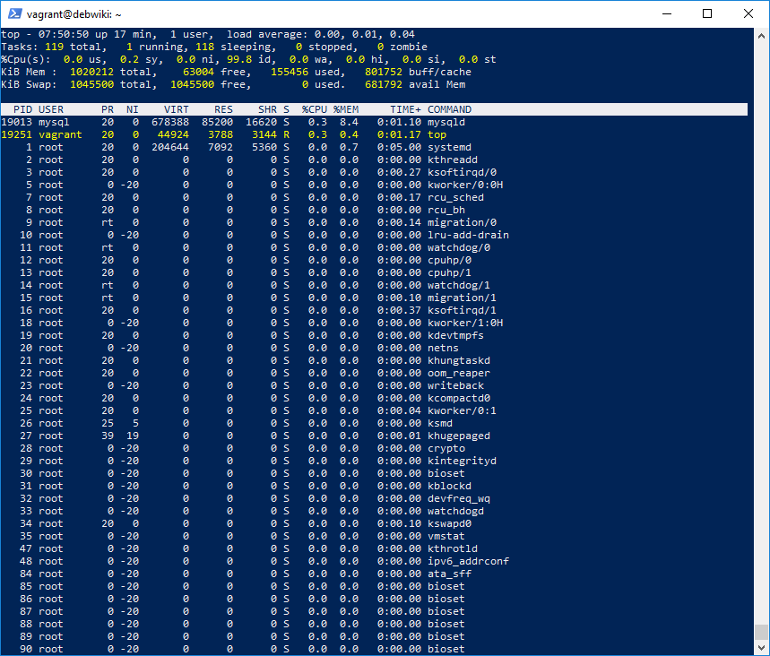
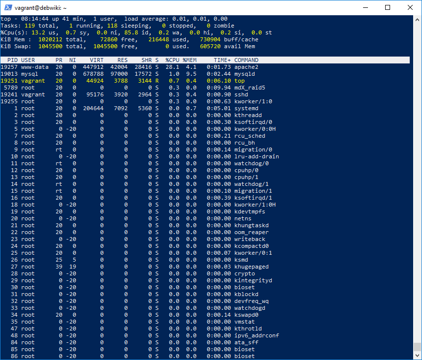

# Práctica Módulo 02 - SysAdmin
Proyecto académico con el objetivo de montar dos máquinas con las siguientes aplicaciones ([enunciado](./Enunciado_Practica_Agile_Sysadmin.pdf)):
* Máquina 1 (**debelk**): 
  * Logstash.
  * Elasticsearch.
  * Kibana.
  * Nginx.
* Máquina 2 (**debwiki**): 
  * Apache.
  * Mediawiki.
  * MariaDB.
  * Filebeats.

Además:
* La información de las bases de datos de ambas máquinas se debe persistir en un volumen lógico aparte.
* La máquina 2 debe publicar la información de sus logs en la máquina 1 (estarán en la misma red privada).

## Requisitos
Se ha comprobado correctamente el despliegue de la infraestructura en un sistema operativo Windows 10, con las siguientes aplicaciones previamente instaladas:
* [VirtualBox](https://www.virtualbox.org/) 6.0.10.
* [Vagrant](https://www.vagrantup.com/) 2.2.5.

## Instrucciones de despliegue de la infraestructura
Se puede desplegar la infraesctructura clonando este repositorio, y ejecutando:
* Windows 10: [ejecutar.ps1](./vagrant/ejecutar.ps1).
* Linux (dar permiso de ejecución): [ejecutar.sh](./vagrant/ejecutar.sh).

Esto desplegará las dos máquinas virtuales, y hará accesibles sus servicios en las siguientes direcciones desde el host:
* Mediawiki: [http://localhost:8000/mediawiki/](http://localhost:8000/mediawiki/)
* Kibana: [http://localhost:8001/](http://localhost:8001/)

Las credenciales para acceder a los servicios son las siguientes:
* Mediawiki.
  * Usuario: "ure".
  * Contraseña: "ureureure".
* Kibana.
  * Usuario "admin".
  * Contraseña "hola".

Tras navegar por la Mediawiki, se puede acceder a Kibana, y crear un índice con el filtro "*logstash**". Se podrán observar los registros de los logs procedentes de la Mediawiki (de Apache y de MariaDB).

Ejemplo Mediawiki:

Ejemplo Kibana:

## Esquema de la infraestructura

## Solución de problemas

En ocasiones, aleatoriamente, se ha experimentado que Vagrant se cuelga en el punto "*SSH auth method: private key*". El problema se solucionó con un "*vagrant destroy <nombremáquina>*", de la máquina cuyo montaje da el problema, y volviendo a ejecutar "*vagrant up <nombremáquina>*".

En el [Vagrantfile](./vagrant/Vagrantfile), las máquinas virtuales tienen como base "*debian/stretch64*". Para utilizar discos de almacenamiento extra, se utiliza el parámetro "*SATA Controller*" en el "*vb.customize*". Se ha visto que, con la base "*ubuntu/xenial64*", resultó necesario utilizar el parámetro "*SCSI*".

Para el diagnóstico de algún problema nuevo, se puede hacer un "*diff*" entre el archivo de log generado con la máquina en la que se ha producido el problema, y los existentes en este repositorio:
* [log_elk.txt](./vagrant/log_elk.txt).
* [log_wiki.txt](./vagrant/log_wiki.txt).

## Scripts de instalación

### Máquina "debelk"
Para realizar la instalación se ha utilizado el script [install_elk.sh](./vagrant/elk/install_elk.sh), que realiza las siguientes operaciones:

 1. Actualizar el repositorio de paquetes del sistema operativo, e instalar los prerrequisitos de software para las aplicaciones que se ejecutarán en la máquina.
 2. Crear el volumen lógico en RAID 5, con los 4 discos extras que se han incorporado para la máquina en el "*Vagrantfile*"; montarlo en el directorio "*/debelk_data*"; y establecer que se monte en cada inicio del sistema.
 3. Instalar Elasticsearch, establecer su directorio de datos en "*/debelk_data/elasticsearch*", y escuchar en "*localhost:9200*".
 4. Instalar Kibana, y escuchar en "*localhost:5601*".
 5. Instalar Nginx como reverse proxy para exponer Kibana en el puerto 80 al exterior ([site-localhost-nginx](./vagrant/elk/site-localhost-nginx)).
 6. Instalar Logstash, configurando la entrada de datos con Beats en el puerto **5044**, y la salida de datos a Elasticsearch ([logstash_wiki.conf](./vagrant/elk/logstash_wiki.conf)).

### Máquina "debwiki"
Para realizar la instalación se ha utilizado el script [install_wiki.sh](./vagrant/wiki/install_wiki.sh), que realiza las siguientes operaciones:

 1. Actualizar el repositorio de paquetes del sistema operativo.
 2. Crear el volumen lógico en RAID 5, con los 4 discos extras que se han incorporado para la máquina en el "*Vagrantfile*"; montarlo en el directorio "*/debwiki_data*"; y establecer que se monte en cada inicio del sistema.
 3. Instalar Apache con PHP (expone puerto 80).
 4. Instalar MariaDB, establecer su directorio de datos en "*/debwiki_data/mysql*", y escuchar en "*localhost:3306*" ([50-server.cnf](./vagrant/wiki/50-server.cnf)).
 5. Restaurar copia de seguridad de la base de datos "*mediawikidb"* (base de datos limpia con un usuario de prueba [mediawikidb.sql](./vagrant/wiki/mediawikidb.sql)).
 6. Establecer la configuración de seguridad en MariaDB.
 7. Instalar Mediawiki expuesta con Apache, y configurando su base de datos en MariaDB ([LocalSettings.php](./vagrant/wiki/LocalSettings.php)).
 8. Instalar Filebeat, configurando la recolecta de los logs de Apache y MaríaDB, y su envío a la máquina "**debelk**", 10.0.0.10:**5044**, ([filebeat.yml](./vagrant/wiki/filebeat.yml)).

## Análisis de rendimiento

Los valores adecuados para el espacio de almacenamiento, la CPU y la RAM, podrían visualizarse en una gráfica en función de la carga del sistema. Para obtener dicha gráfica podrían utilizarse pruebas de carga, utilizando robots, por ejemplo.

### Máquina "debelk"

Se han utilizado 2 GB de memoria RAM. El rendimiento del sistema está en función del número publicaciones de log remotas que reciba, y del número de usuarios que deba soportar. Sin haber hecho las pruebas de carga, se aprecia que el consumo de recursos aumenta significativamente, por lo que es probable que el sistema necesite más recursos con un incremento moderado de la carga.

Carga en reposo:

Carga con un acceso:

### Máquina "debwiki"

Se ha utilizado 1 GB de memoria RAM. El rendimiento del sistema está en función del número de usuarios que deba soportar. Sin haber hecho las pruebas de carga, se aprecia que el consumo de recursos no aumenta significativamente, es menos probable que el sistema necesite más recursos con un aumento moderado del número de usuarios.

Carga en reposo:

Carga con un acceso:

## Escalabilidad y disponibilidad

Para mejorar estos dos aspectos, se podrían haber utilizado contenedores Docker en un clúster Kubernetes, con un sistema de copia de seguridad para posibilitar la restauración en caso de desastre.
